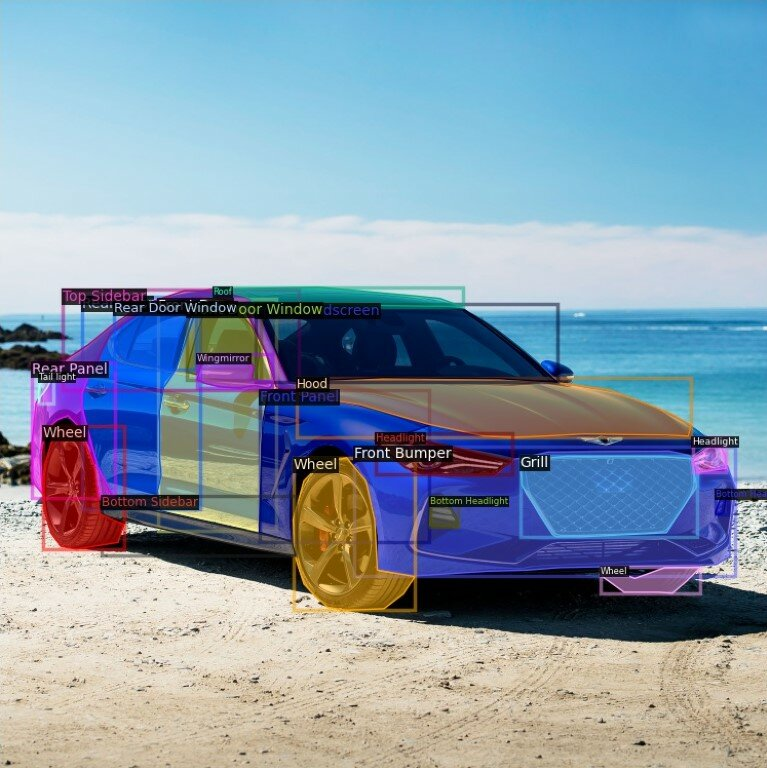

# Car Parts Segmentation — ( UNET++ , SAM , SegFormer)

A production-grade, multi-model semantic segmentation pipeline for fine-grained car
exterior part segmentation (50 classes), supporting three model families:

1. **UNet++** (with pretrained encoders via `segmentation_models_pytorch`) — strong CNN baseline
2. **SegFormer** (Mix Transformer / ViT-based) — current go-to for semantic segmentation
3. **SAM** (Segment Anything) — mask decoder fine-tuning for prompted/automatic segmentation

## Demo Segmentation


<table width="90%" align="center" style="table-layout: fixed;">
  <thead>
    <tr>
      <th align="center" style="font-size: 12px;">LS Pose Segementation Map</th>
      <th align="center" style="font-size: 12px;">RS Pose Segementation Map</th>
    </tr>
  </thead>
  <tbody>
    <tr>
      <td></td>
      <td></td>
    </tr>
  </tbody>
</table>


### Car Parts Segmentation Visualizer With SAM


[]()


## Project layout

```
Custom-Image-Segmentation-with-Unet-PlusPlus/
├── configs/                     # YAML configs per model family
│   ├── unetpp.yaml
│   ├── segformer.yaml
│   └── sam.yaml
├── car_seg/
│   ├── data/                    # Dataset, transforms, mask handling
│   ├── losses/                  # Dice, Focal, CE, compound
│   ├── models/                  # UNet++, SegFormer, SAM wrappers
│   ├── engine/                  # Training, eval, inference loops
│   └── utils/                   # Metrics, logging, viz, config, ckpt
├── scripts/                     # CLI entry points
│   ├── train.py
│   ├── evaluate.py
│   ├── infer.py
│   ├── export_onnx.py
│   └── sam_pseudolabel.py
└── requirements.txt
└── README.md
```


## Quick start

```bash
pip install -r requirements.txt

# Train any of the three model families (just point at the right config):
python scripts/train.py --config configs/unetpp.yaml
python scripts/train.py --config configs/segformer.yaml
python scripts/train.py --config configs/sam.yaml

# Evaluate
python scripts/evaluate.py --config configs/segformer.yaml --ckpt runs/segformer/best.pt

# Inference (single image, folder, or video frame)
python scripts/infer.py --config configs/segformer.yaml --ckpt runs/segformer/best.pt \
    --input path/to/image_or_dir --output preds/

# Export
python scripts/export_onnx.py --config configs/segformer.yaml --ckpt runs/segformer/best.pt
```

## Segmentation Result
Below is an example of a segmented car with labeled parts:




## Design notes

- **Single training loop** in `car_seg/engine/trainer.py` is reused for all model
  families. Only the model wrapper changes (forward signature is unified to
  `model(image) -> logits[B, C, H, W]` for semantic models; SAM has its own path
  with prompts).
- **Compound loss** (Dice + CE) with optional Focal/class-weighting is the default —
  necessary for 50 imbalanced classes.
- **SAM fine-tuning** freezes the image encoder (the expensive ViT) and trains
  only the mask decoder + prompt encoder. This is what the SAM paper recommends for
  domain adaptation and is ~150× cheaper than full fine-tuning.
- **SegFormer** is loaded via HuggingFace `transformers` so we get the MiT-B0..B5
  pretrained backbones for free. The MiT-B2 backbone with our 50-class head is the
  default — best accuracy/speed trade-off in our setup.


## License
This project is licensed under the MIT License.

## Author
Tanup Vats


